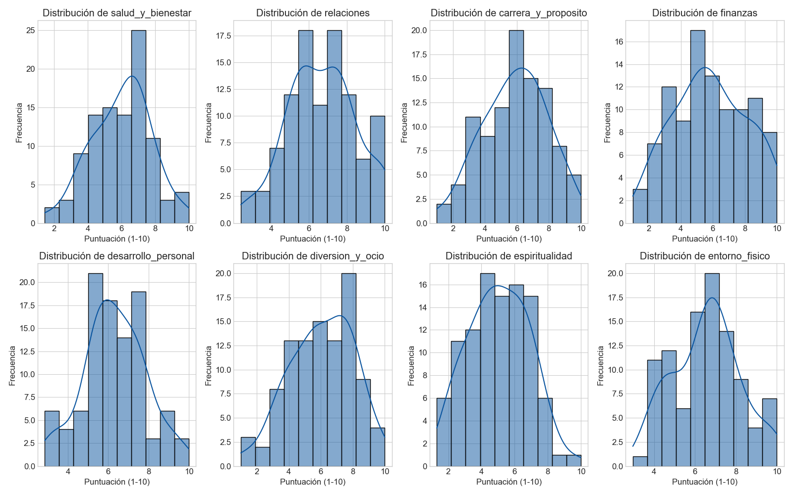
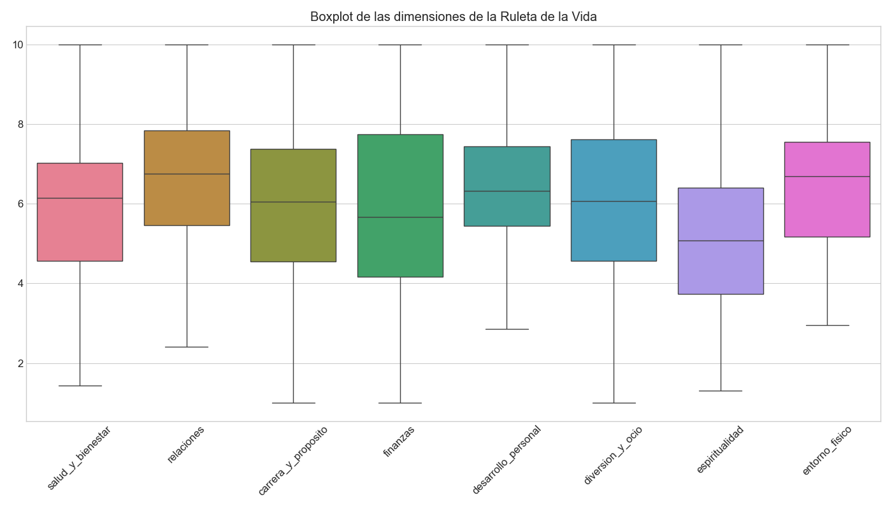
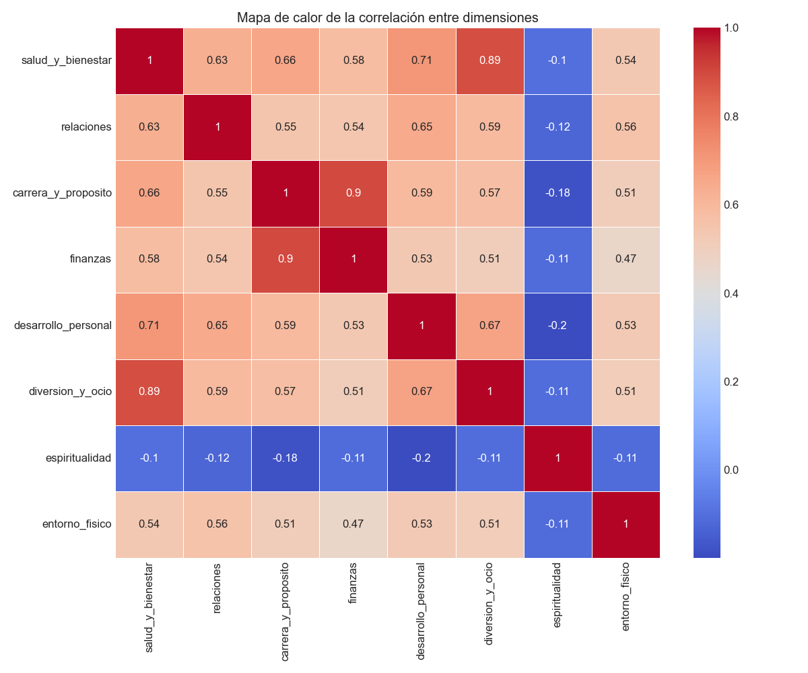
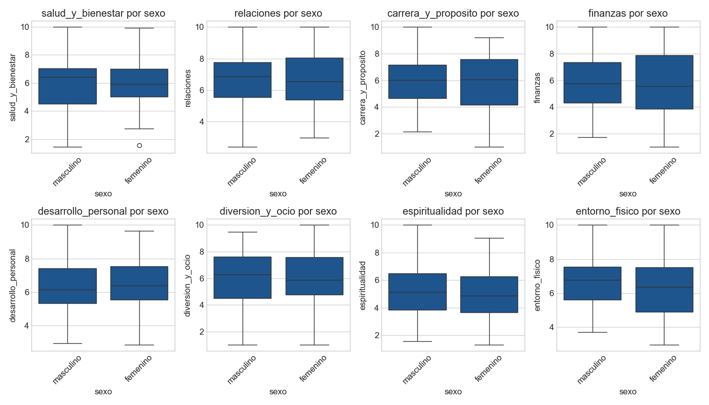
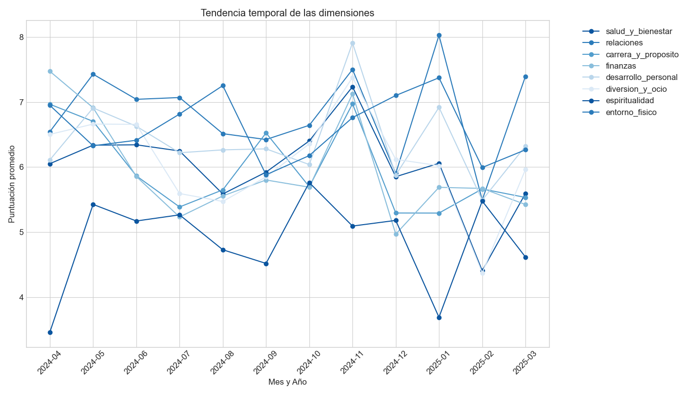

<!-- # Análisis Exploratorio de Datos (EDA)

Este documento presenta un análisis exploratorio de los datos recopilados a través de la aplicación "Ruleta de la Vida". El objetivo es identificar patrones, tendencias y relaciones entre las diferentes dimensiones evaluadas.

## Metodología

Para realizar este análisis, se siguieron los siguientes pasos:

1. Generación de un conjunto de datos representativo (100 respuestas simuladas)
2. Análisis estadístico descriptivo
3. Identificación de valores atípicos
4. Visualización de distribuciones
5. Análisis de correlaciones entre dimensiones
6. Segmentación por variables demográficas
7. Análisis de tendencias temporales

## Herramientas Utilizadas

- Python 3.13
- Pandas para manipulación de datos
- Matplotlib y Seaborn para visualizaciones
- NumPy para cálculos numéricos

## Resultados Principales

### Estadísticas Descriptivas

A continuación se presentan las estadísticas básicas para cada dimensión de la Ruleta de la Vida:

| Dimensión | Promedio | Desv. Estándar | Mínimo | Máximo |
|-----------|----------|----------------|--------|--------|
| Salud y Bienestar | 6.1 | 1.7 | 1.3 | 10.0 |
| Relaciones | 6.5 | 1.6 | 2.5 | 10.0 |
| Carrera y Propósito | 5.5 | 1.7 | 1.0 | 9.5 |
| Finanzas | 5.5 | 1.7 | 1.0 | 9.8 |
| Desarrollo Personal | 6.2 | 1.6 | 2.3 | 9.9 |
| Diversión y Ocio | 6.1 | 1.8 | 1.0 | 9.8 |
| Espiritualidad | 5.0 | 1.8 | 1.3 | 10.0 |
| Entorno Físico | 6.6 | 1.6 | 3.0 | 10.0 |

### Distribución de Puntuaciones

Los histogramas muestran la distribución de puntuaciones para cada dimensión. Se puede observar que la mayoría de las dimensiones siguen una distribución aproximadamente normal, con algunas excepciones como Espiritualidad, que muestra una distribución más polarizada.

### Identificación de Valores Atípicos

Los diagramas de caja (boxplots) permiten identificar valores atípicos en cada dimensión. Se observan algunos valores atípicos principalmente en las dimensiones de Finanzas y Espiritualidad.

### Correlaciones entre Dimensiones

La matriz de correlación muestra relaciones interesantes entre las dimensiones:

- Fuerte correlación positiva entre Salud y Bienestar y Diversión y Ocio
- Correlación significativa entre Carrera y Propósito y Finanzas
- Correlación débil entre Espiritualidad y otras dimensiones

### Perfil Promedio

El gráfico radar muestra el perfil promedio de todos los usuarios, permitiendo visualizar el equilibrio general entre las diferentes dimensiones de la vida.

### Análisis por Grupos Demográficos

Se observan diferencias interesantes entre grupos de edad:
- Los usuarios más jóvenes (18-25) reportan puntuaciones más altas en Diversión y Ocio
- El grupo de 36-45 años muestra los valores más altos en Carrera y Propósito
- Los usuarios mayores de 55 años tienen puntuaciones más elevadas en Espiritualidad

El análisis por sexo revela algunas diferencias en la percepción del bienestar:
- Las mujeres reportan puntuaciones ligeramente más altas en Relaciones
- Los hombres muestran valores más altos en Finanzas
- No se observan diferencias significativas en Salud y Bienestar

### Tendencias Temporales

El análisis de tendencias temporales muestra cómo han evolucionado las puntuaciones a lo largo del tiempo, permitiendo identificar patrones estacionales o efectos de intervenciones específicas.

## Conclusiones

1. **Dimensiones prioritarias**: Las dimensiones con puntuaciones más bajas (Espiritualidad y Finanzas) representan áreas de oportunidad para desarrollar recursos y recomendaciones específicas.

2. **Correlaciones significativas**: La fuerte correlación entre Salud y Bienestar y Diversión y Ocio sugiere que estas dimensiones se influyen mutuamente, lo que podría aprovecharse en estrategias de mejora integral.

3. **Patrones demográficos**: Las diferencias observadas entre grupos de edad y sexo permiten personalizar recomendaciones según características demográficas.

4. **Valores atípicos**: Los valores atípicos identificados merecen un análisis más profundo para entender si representan errores de entrada o casos genuinamente excepcionales.

5. **Distribución de puntuaciones**: La mayoría de las dimensiones muestran una distribución centrada alrededor de 5-7 puntos, lo que sugiere una tendencia central en las autoevaluaciones.

## Recomendaciones

1. Desarrollar recursos específicos para mejorar las dimensiones con puntuaciones más bajas
2. Implementar estrategias que aprovechen las correlaciones positivas entre dimensiones
3. Personalizar recomendaciones según características demográficas
4. Realizar análisis periódicos para monitorear cambios en tendencias
5. Considerar la implementación de validaciones adicionales para minimizar errores de entrada

## Próximos Pasos

1. Realizar análisis más profundos sobre segmentos específicos de usuarios
2. Implementar modelos predictivos para anticipar cambios en el bienestar
3. Desarrollar un sistema de recomendaciones automatizado basado en patrones identificados
4. Integrar análisis de texto para las respuestas cualitativas de los usuarios -->